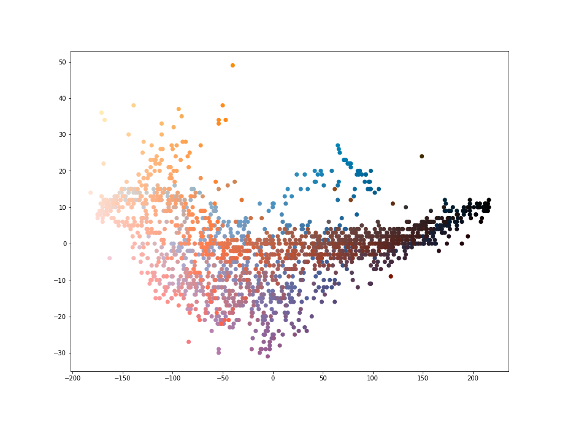
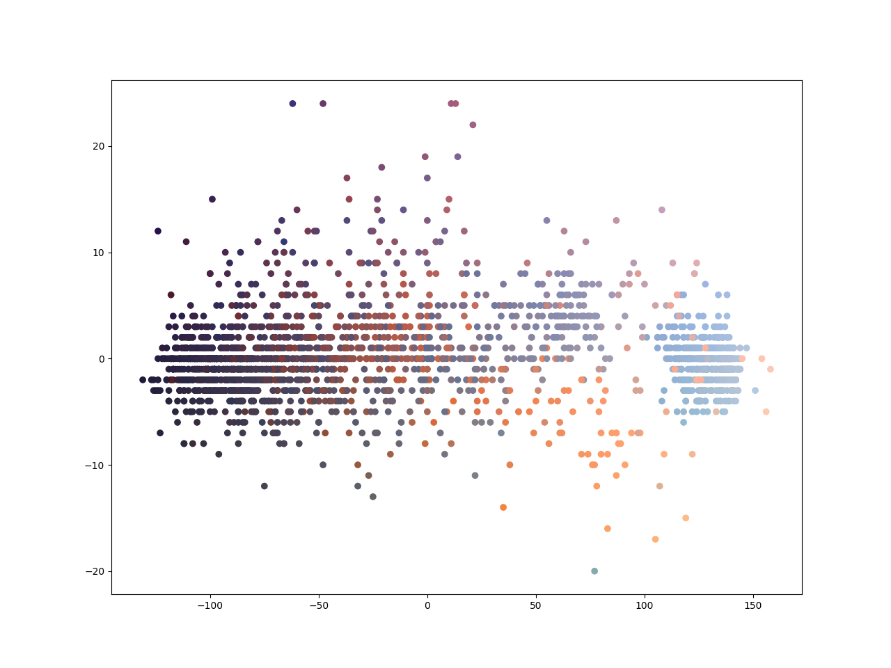
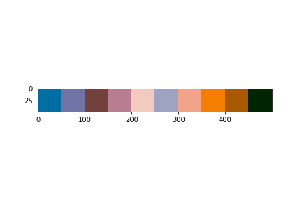
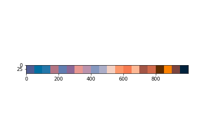
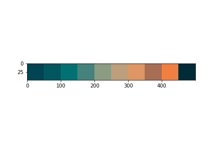
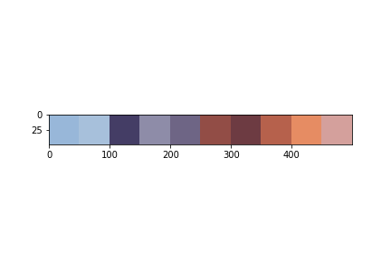

# Skylite Playground
This project exists as a playground to experiment with algorithms that will _find the most novel colors in a given image of the sky_.

## Intro
Here's an example picture that if given to one of the algorithms below would return a set of the top N novel colors: 
{orange, blue, red, yellow, off-white}

 

## Algorithms
TODO - performance table

| Algorithm Name | Version | Time To Palette | Palette Score (1-10)|
|----------------|---------|-----------------|---------------------|
| Eigen Vectors  | 0.0     | TODO            |0                    |
| Claudia's Criterion + KMeans + Geometric Mean | 0.0 | TODO | 8   |         

### Eigenvectors and Eigenvalues
I did some light Googling and stumbled upon this [blog post](http://www.aishack.in/tutorials/dominant-color/) 
(shout out to Utkarsh Sinha who broke down the problem in to understandable chunks) which was
in C++ so I loosely translated it to Python, therefore I cannot take credit for it. Had it produced better results for
this project, I would have most certainly rewritten it in a more Pythonic / performant fashion.

#### Results
The colors returned seemed washed out with 6 colors and was marginally better with 20 colors:


### PCA + K-Means
Some friends suggested plotting the image using PCA components to help get some ideas about how to split up the data. 



Here we see a subset of the pixels (random normal) projected on to the first and third best eigen vectors (thanks PCA). At first
it seemed like a good idea to do some sort of cutoff such that I could cut the darker uninteresting colors out, but I
found that the axes were not consistent among different images.



When discussing this problem, another friend then contributed an amazing filtering function that removes most of the
dark colors! (see `notebooks/claudia_criterion.ipynb`).

I then used this twice filtered set of pixels (random normal + claudia's criterion) to do KMeans clustering.

1. Randomly sample of the image (1/1000)
2. Apply Claudia’s Criterion ™️ to the sample
3. Apply KMeans n=10 on the remaining points
4. Classify each point in to a cluster
5. Compute geometric mean for each cluster
6. Print palette
7. ???
8. Profit

```bash
python -m skylite_playground.kmeans ./data/training/sea_1.png
```

#### Results





 _Now That's What I Call A Palette! : Volume I_

The dark color(s) present is due to a division by zero error, here are some other palettes this algorithm produced:




---
## Can you do better?
Make a Fork and PR if you have any cool ideas you want to share. All benchmarks are done with
`data/training/sunset_1.jpg`
