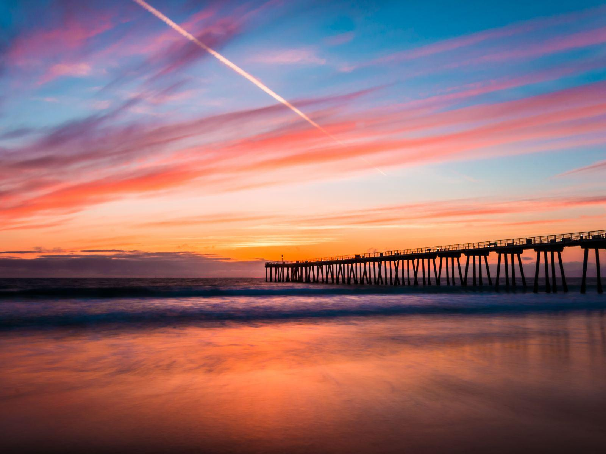

# Skylite Playground
This project exists as a playground to experiment with algorithms that will _find the most novel colors in a given image of the sky_.

## Intro
Here's an example picture that if given to one of the algorithms below would return a set of the top N novel colors: 
{orange, blue, red, yellow, off-white}

 

## Algorithms
### Eigenvectors and Eigenvalues
I did some light Googling and stumbled upon this [blog post](http://www.aishack.in/tutorials/dominant-color/) 
(shout out to Utkarsh Sinha who broke down the problem in to understandable chunks) which was
in C++ so I loosely translated it to Python, therefore I cannot take credit for it. Had it produced better results for
this project, I would have most certainly rewritten it in a more Pythonic / performant fashion.

#### Results
The colors returned seemed washed out with 6 colors and was marginally better with 20 colors:

### K-Means
TODO